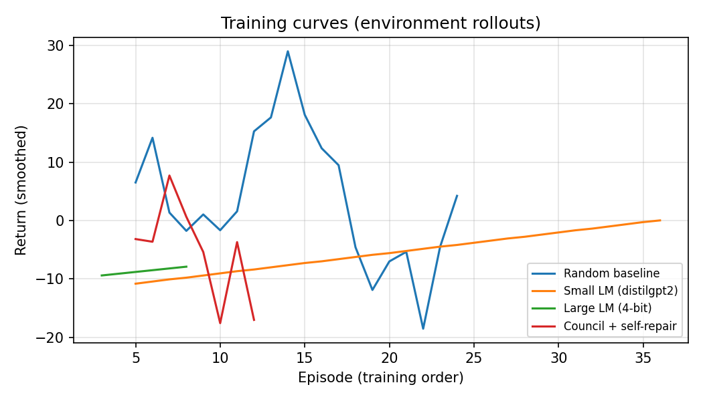
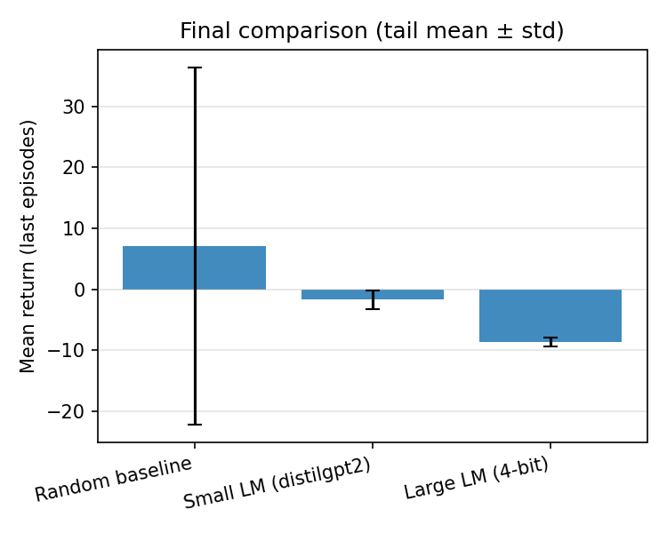
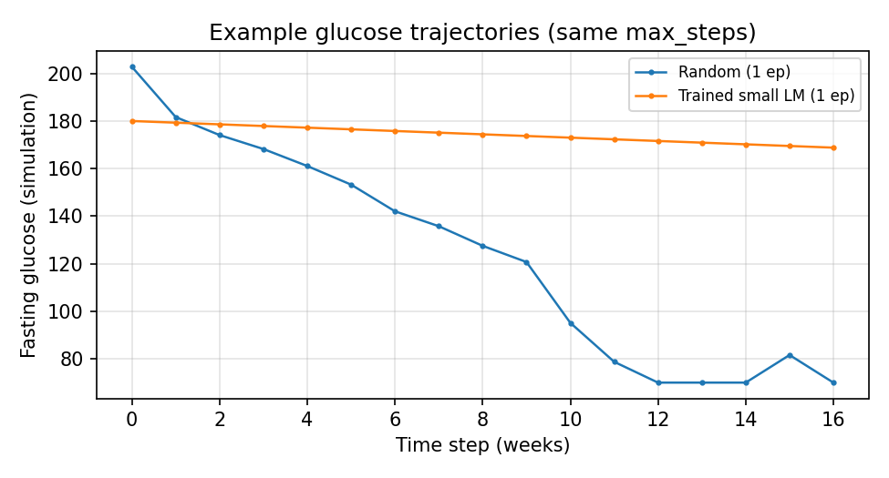
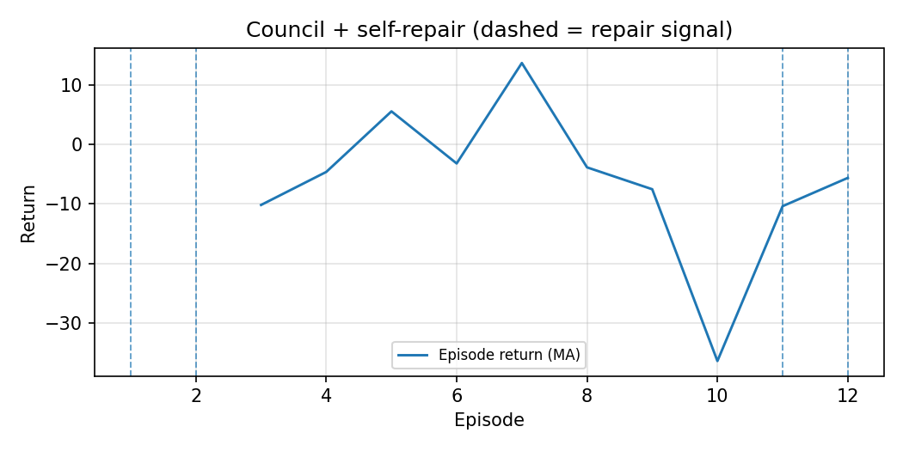
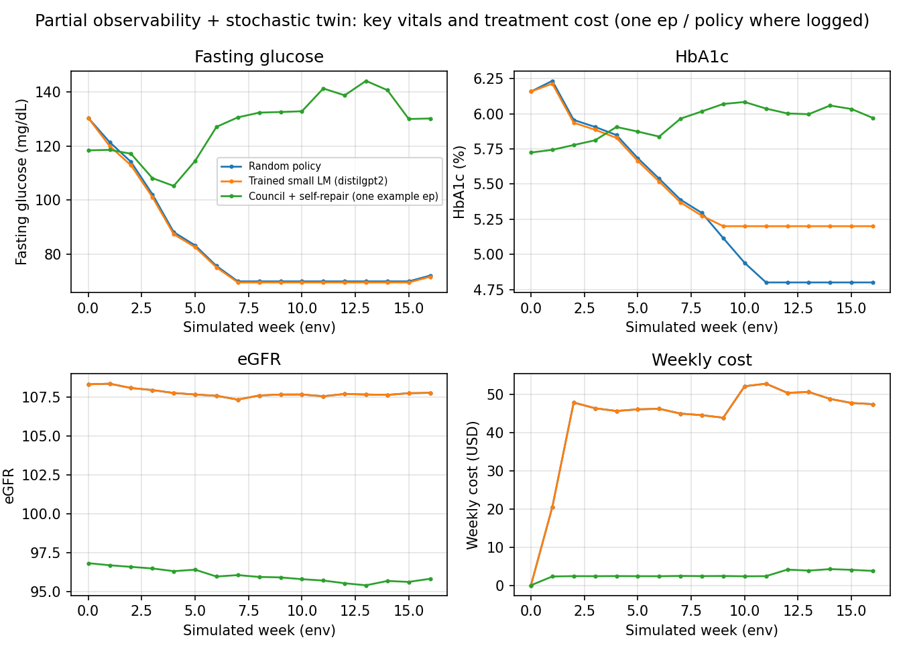
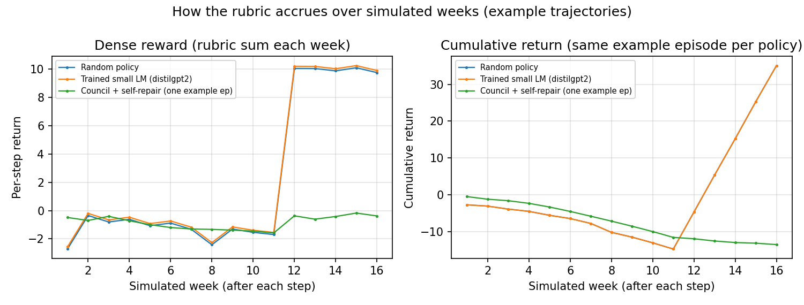
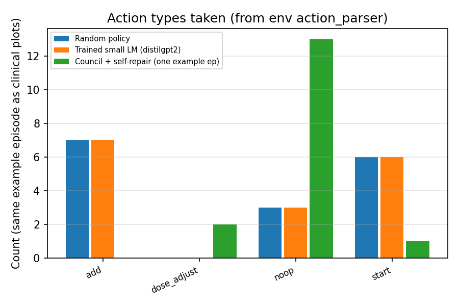
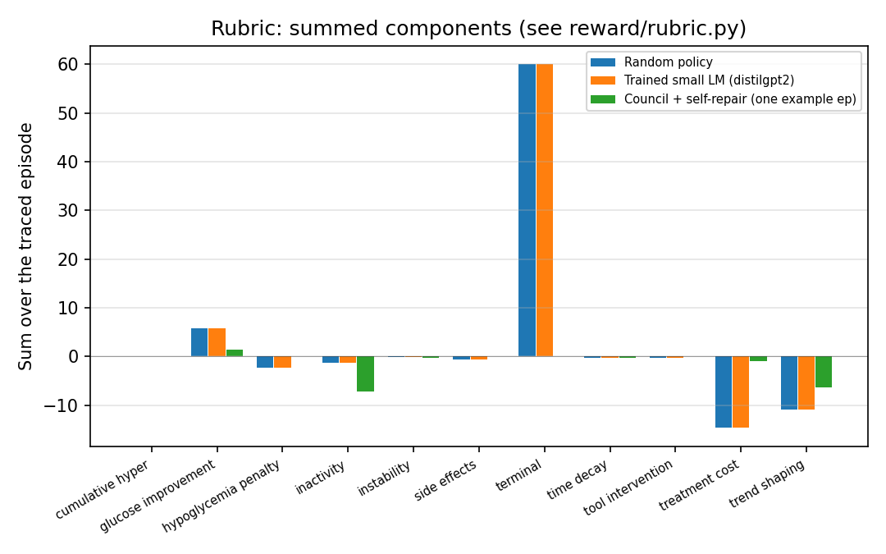
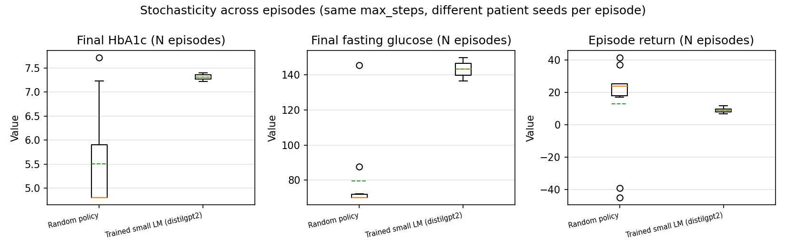
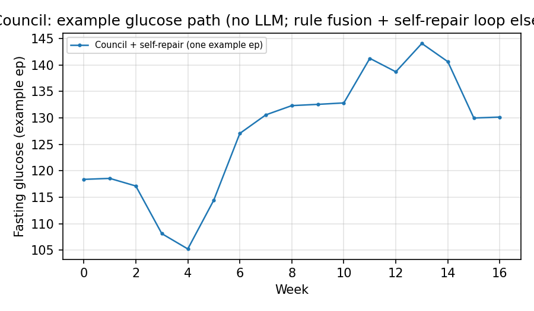

# Digital Twin Medicine — RL Agent for Personalized Treatment

> *"The same insulin dose that saves one patient sends another into hypoglycaemia. The same metformin that controls one patient's glucose does nothing for the next. Medicine prescribes to populations — this project prescribes to individuals."*

**OpenEnv Hackathon 2026 · Track #3.1 — World Modeling (Professional Tasks)**

| | |
|---|---|
| **UI (Streamlit Space)** | `https://huggingface.co/spaces/mano678/DART_1` |
| **OpenEnv env server (Docker / FastAPI)** | `<ADD_OPENENV_SPACE_URL_HERE>` |
| **Single Colab link (submit this)** | `https://colab.research.google.com/github/mano45sudo-lgtm/DART/blob/main/training/DART_Colab_submission.ipynb` |
| **Mini-blog / demo video** | `<ADD_BLOG_OR_VIDEO_URL_HERE>` |

**README figures** under §5 use **committed** files in `docs/figures/` (regenerate anytime with `python scripts/generate_readme_demo_figures.py`, or run `training/DART_Colab_submission.ipynb` for full training). Same relative paths render on **GitHub** and **Hugging Face** when this repository (including PNGs) is pushed to the Space remote.

---

## 1 · The problem

Type 2 diabetes (T2DM) affects **hundreds of millions** of people. Guidelines often use a one-size-fits-many escalation path. This project instead learns a **sequential** treatment policy in a **stochastic digital twin** so decisions can adapt as new (partial) observations arrive week by week.

**Capability we target:** policies that make **repeated, personalized** decisions under uncertainty, with explicit **cost, safety, and physio** terms — not a single static plan.

---

## 2 · The environment and reward

### `DigitalTwinDiabetesEnv` (`env/digital_twin_env.py`)

- **Horizon:** up to `max_steps` simulated weeks (default in Colab is **20**; the env can run up to **52**).
- **Observation (partial):** the policy only sees a clinical subset each step, e.g. `week`, `hba1c`, `fasting_glucose`, `bmi`, `systolic_bp`, `egfr`, `ckd`, `cvd`. Latent or history-rich details are not all exposed.
- **Action:** a single **JSON** object per week (`noop`, `start`, `add`, `stop`, `switch`, `dose_adjust`, …) validated via `safe_action` / the twin’s dynamics.
- **Stochasticity:** `reset(seed=…)` draws a **new simulated patient**; training and eval sweep many seeds.

### `RewardRubric` (`reward/rubric.py`) — decomposed, dense reward

The step reward is a **sum of named terms** (not a black-box label). These names appear in logs and in **`judge_rubric_episode_totals.png`** when you run the submission Colab:

| Component (concept) | Role |
|----------------------|------|
| `glucose_improvement` / trend | FPG and HbA1c movement toward targets |
| `hypoglycemia_penalty` | Low glucose and hypo-type side events |
| `instability` | Swings in glucose (magnitude and acceleration) |
| `treatment_cost` | Penalty scaled by `weekly_cost_usd` from the sim |
| `inactivity` / repeats | Stalling on `noop` or repeating the same action |
| `time_decay` | Mild pressure over the week index |
| `cumulative_hyper` | Prolonged exposure to high glucose |
| `tool_intervention` | Safety / forced intervention paths (e.g. fall recovery) |
| `terminal` | Large bonus/penalty at episode end (e.g. remission vs hard failure) |

**Episode return** = sum of weekly step returns (what you see on learning curves and bar charts).

### Safety and tooling in the stack

- **Fall detection and recovery** can rewrite unsafe actions in the env (see `fall_detection.py` and env `step` logic).
- **Council + self-repair** (`council.py`, `training/council_rollout.py`, `self_improvement.py`): a **non-LLM** stack that fuses multiple rule-style agents, tunes exploration, and marks **self-repair** episodes for plots.

### Clinical / decision tools in the repo

| Module | Purpose |
|--------|---------|
| `tools/ehr.py` | Structured patient context |
| `tools/genomics.py` | Variant-aware signals |
| `tools/interactions.py` | Drug–drug checks |
| `tools/progression_forecast.py` | Short-horizon trajectory view |
| `tools/trial_sim.py` | In-silico trialing |
| `tools/biomarkers.py` | Biomarker-style interpretation |
| `tools/resistance.py` | Resistance heuristics |
| `tools/risk.py` | CV / renal risk style scoring |

---

## 3 · Training: CLI and live rollouts

The training loop in `scripts/train_reinforce_twin.py` uses **on-policy** rollouts in the twin (no static dataset for the RL signal).

```text
for each update:
  sample episodes in DigitalTwinDiabetesEnv
  REINFORCE loss on generated actions
  optimizer step
```

| Mode | Command | Notes |
|------|---------|--------|
| Smoke (CPU) | `python scripts/train_reinforce_twin.py --quick` | `tiny-gpt2`, fast wiring check |
| Judge preset | `python scripts/train_reinforce_twin.py --judge-preset` | Longer `distilgpt2` run |
| Custom | `python scripts/train_reinforce_twin.py --judge-schedule --model <HF_ID> --out-json logs/...` | e.g. 4-bit 8B with `--load-in-4bit` when GPU available |

**Colab in-process path:** `training/DART_Colab_submission.ipynb` calls `training/colab_episode_rl.py` (REINFORCE helpers, **clinical traces**, **N-episode endpoints**, optional council logging) and writes a **single** JSON: `logs/colab_experiment.json`. Figures are generated by `scripts/plot_colab_publication.py` and `scripts/plot_colab_judge_insights.py`.

---

## 4 · `DART_Colab_submission.ipynb` — one notebook, full evidence

This is the **default submission Colab** (full training + all figures + judge dashboard). Other notebooks in `training/` are optional: legacy two-bar `colab_judge_pipeline.ipynb`, TRL smoke, HTTP server demo, etc.

### Default `CONFIG` (edit one block in the notebook)

| Key | Default (typical) | Meaning |
|-----|------------------|---------|
| `max_steps` | `20` | Simulated weeks per episode |
| `random_episodes` | `40` | Random-baseline training log length |
| `small.updates` / `episodes_per_update` | `24` / `2` | distilgpt2 REINFORCE schedule |
| `large.*` | 8B 4-bit, `updates=8` | Skipped if **no GPU** |
| `council_episodes` | `16` | Council + self-repair episode log |
| `ma_window` | `5` | Moving average for training curve |
| `bar_tail_episodes` | `15` | Last *K* episodes for tail mean in bar plot |
| `judge_endpoint_episodes` | `20` | Independent eval rollouts for **boxplots** |
| `judge_trace_env_seed` | `50_200` | **Same** env seed for **random vs distil** one-episode traces (same virtual patient) |
| `out_json` | `logs/colab_experiment.json` | Single file for all episode rows, traces, endpoints |

**Outputs on disk (under repo root, created when you run the notebook):**

| File | Content |
|------|---------|
| `logs/colab_experiment.json` | `episodes` (per-model rows), `glucose` (1-ep FPG for legacy plot), `traces` (full 1-ep **clinical** trace per policy: vitals, rubric components, actions, $), `endpoints` (lists of final HbA1c/FPG/return over **N** seeds), `self_repair_episodes`, config echo |

**Plotting scripts (invoked at end of the notebook):**

- `scripts/plot_colab_publication.py` — aggregate training / bars / glucose / council.
- `scripts/plot_colab_judge_insights.py` — judge-focused panels (see §5).

To **recompute figures** from an existing JSON (after download):

```bash
cd DART
python scripts/plot_colab_publication.py --in-json logs/colab_experiment.json --out-dir docs/figures
python scripts/plot_colab_judge_insights.py --in-json logs/colab_experiment.json --out-dir docs/figures
```

**Quick demo (no GPU, no HF model):** regenerate committed README charts and `logs/colab_experiment.json`:

```bash
python scripts/generate_readme_demo_figures.py
```

---

## 5 · Results — figures and metrics from the submission Colab

The images below point at files in **`docs/figures/`** (demo batch generated by `python scripts/generate_readme_demo_figures.py`; replace by running **`DART_Colab_submission.ipynb`** for real training runs). Commit `docs/figures/*.png` so the README renders on GitHub and Hugging Face.

### 5.1 — Publication / training (script: `plot_colab_publication.py`)

**Training curve (smoothed episode return by training order, multiple policies)**



*Expected file:* `docs/figures/training_curve.png`  
*Meaning:* Smoothed per-episode return (`ma_window` from config) for `random`, `distilgpt2`, optional `llama-8b-4bit` if trained on GPU, and council when present.

**Final comparison (tail mean ± std)**



*Expected file:* `docs/figures/final_comparison_bars.png`  
*Meaning:* Mean return over the **last** `bar_tail_episodes` episodes per model, with error bars (std). **To record numbers:** read the bar height and error from the plot, or compute from `colab_experiment.json` (filter `episodes` by `model`, take the last *K* `reward` values, `mean` and `std`).

**Example glucose trajectories (1 episode each, legacy overlay)**



*Expected file:* `docs/figures/behavior_glucose.png` (written when `glucose.random` and `glucose.trained` exist in JSON)  
*Meaning:* FPG vs time step for one random vs one distil trace from the run (separate from the same-seed `traces` used in judge figures).

**Council + self-repair (episode return + repair markers)**



*Expected file:* `docs/figures/self_repair_episodes.png` (when council rows exist)  
*Meaning:* Council episode return over index; **dashed vertical lines** at `self_repair_episodes` from the JSON (exploration / fallback signals in the self-improvement loop).

### 5.2 — Judge dashboard (script: `plot_colab_judge_insights.py`)

**Clinical state (example episode per policy: same seed for random vs distil when using default `judge_trace_env_seed`)**



*File:* `docs/figures/judge_clinical_state.png`  
*Panels:* FPG, HbA1c, eGFR, **weekly cost (USD)** vs simulated week. Shows **dynamics and cost** in one view.

**Per-step and cumulative return (rubric as it accrues)**



*File:* `docs/figures/judge_step_and_cumulative_return.png`  
*Left:* Dense weekly reward. *Right:* Cumulative return over the same example episode.

**Action mix (parsed `type` counts)**



*File:* `docs/figures/judge_action_mix.png`  
*Meaning:* How often each JSON action `type` was used in the logged example episode per policy.

**Rubric — summed over the traced episode**



*File:* `docs/figures/judge_rubric_episode_totals.png`  
*Meaning:* Stacked component sums; names match `RewardRubric` in `reward/rubric.py`. Use this to explain **which terms** moved (glucose, cost, hypo, inactivity, …).

**Outcome distributions (N eval episodes, different seeds)**



*File:* `docs/figures/judge_outcome_distributions.png`  
*Meaning:* Boxplots of **final HbA1c**, **final fasting glucose**, and **episode return** across `judge_endpoint_episodes` per model (`endpoints` in JSON). This is the **stochastic** half of the story (many patients), complementing the **single-seed** traces above.

**Council — example glucose (optional file)**



*File:* `docs/figures/judge_council_glucose_example.png` (if council trace is present)  
*Meaning:* One non-LLM council rollout on the FPG axis for narrative contrast with random / LM.

### 5.3 — Quantitative table (from `logs/colab_experiment.json`)

After a Colab or local run, **fill or script** the table below. Episodes in the JSON are flat rows: `{ "episode", "reward", "avg_reward", "action_count", "model" }`.

| Quantity | How to get it from `colab_experiment.json` |
|----------|---------------------------------------------|
| Tail **mean ± std** per `model` | Last `bar_tail_episodes` values of `reward` for that `model` (same as `final_comparison_bars.png`). |
| **Trace pair** (random vs `distilgpt2`) | `traces.random` and `traces[short_label]` share env seed = `judge_trace_env_seed` in config when you use the default notebook. |
| **N** for boxplots | `len(endpoints.random)`, `len(endpoints.<short_label>)` (should match `judge_endpoint_episodes`). |
| **Repair episodes** | List `self_repair_episodes` (episode indices) printed/plotted for council. |

**Example — quick summary in Python** (from repo root `DART/`):

```python
import json, statistics
from collections import defaultdict

p = "logs/colab_experiment.json"
d = json.load(open(p))
K = d.get("config", {}).get("bar_tail_episodes", 15)
by = defaultdict(list)
for r in d.get("episodes", []):
    by[r["model"]].append(r["reward"])
for m, xs in sorted(by.items()):
    tail = [float(x) for x in xs[-K:]]
    if tail:
        print(m, "n=", len(tail), "tail_mean=", round(statistics.mean(tail), 3),
              "std=", round(statistics.stdev(tail) if len(tail) > 1 else 0.0, 3))
print("judge N:", {k: len(v) for k, v in d.get("endpoints", {}).items()})
```

Replace the table body in your own README fork with the printed line if you need fixed numbers in GitHub (they change every training run).

| Metric (placeholders — replace after your run) | Value |
|-----------------------------------------------|--------|
| Config `max_steps` | from `config` in JSON |
| distilgpt2 — tail mean ± std (last *K* episodes) | *compute* |
| random — tail mean ± std | *compute* |
| Council — tail mean ± std (if any) | *compute* |
| 8B 4-bit — (if trained on GPU) | *compute* or “skipped (no GPU)” |
| `judge_endpoint_episodes` used | *from config* |
| Boxplot cohort sizes | *from `endpoints`* |

> **Legacy** figures: older READMEs may reference `docs/figures/training_vs_baselines.png` or `docs/figures/final_random_vs_trained.png` — the **current** Colab writes the filenames in §5.1–5.2. The **legacy** `plot_judge_two_bar_charts.py` path (two bars only) is `colab_judge_pipeline.ipynb` if you need it for a minimal report.

---

## 6 · Why this matters

| Stakeholder | Value |
|-------------|--------|
| Clinicians / reviewers | Decomposed reward + traces make **what is being optimized** explicit (labs, cost, safety). |
| Patients | Sequential policies aim at **individual** trajectories, not a single global protocol. |
| Systems | Cost and safety terms are in the **objective** alongside glycemic control. |
| Research | Reproducible, open, Gym-style interface + optional **OpenEnv** HTTP server for other clients. |

---

## 7 · Repository structure (high level)

```text
env/                 # DigitalTwinDiabetesEnv, PatientTwin, actions, fall detection
tools/               # EHR, genomics, risk, trialing, etc.
reward/              # RewardRubric (decomposed reward)
training/            # DART_Colab_submission.ipynb, colab_episode_rl, council_rollout, llm_reinforce
council.py           # Council fusion
self_improvement.py  # Exploration / self-repair controller
evaluation/          # Baselines, metrics
ui/                  # Streamlit
scripts/             # train_reinforce_twin, plot_colab_*, run_*, run_evaluation, …
dtm_openenv/         # FastAPI OpenEnv server
docs/figures/        # Colab / CLI generated PNGs (commit after a full run)
logs/                # colab_experiment.json, other training JSON
spaces/              # Docker / HF space configs
```

---

## 8 · Reproduce locally

```bash
git clone <YOUR_REPO_URL>
cd DART
python3 -m venv .venv
source .venv/bin/activate   # Windows: .\.venv\Scripts\Activate.ps1
pip install --upgrade pip
pip install -r requirements.txt
pip install -r requirements_hackathon.txt   # as needed

python scripts/run_sanity.py
python scripts/run_env_demo.py
python scripts/run_evaluation.py
# optional: python scripts/plot_rewards.py
# optional: streamlit: python -m streamlit run ui/app.py
```

To mirror **all** Colab figures without the notebook, train with the CLI to produce a JSON, then add `traces` / `endpoints` in code or re-run the Colab, and call the `plot_colab_*.py` scripts as in §4.

---

## 9 · Hugging Face

### Spaces (if you use them)

| Space | Stack | Entry / notes |
|-------|--------|---------------|
| **Streamlit UI** | Streamlit | Root `app.py` → `ui/app.py` |
| **OpenEnv server** | Docker, `spaces/openenv` | `uvicorn dtm_openenv.server.app:app` — see Space README; health `/health`, docs `/docs` |

**Space sync:** push `main` to both `origin` (GitHub) and the `huggingface` remote so the Space builds from the same tree (Streamlit entry: `app.py` → `ui/app.py`). If a future push to Hugging Face is rejected for large binaries, generate figures locally, keep total image size modest, or use the Hub “sync with GitHub” option.

**Model auth:** for gated LMs, use a **read** token in Colab and `huggingface-cli login` locally as needed.

---

## 10 · Compliance checklist (hackathon / submission)

| Requirement | Where |
|-------------|--------|
| Gym-style env (`reset`, `step`, `state`) | `env/digital_twin_env.py` |
| OpenEnv server available | `dtm_openenv/` |
| Training on **live** rollouts | `train_reinforce_twin.py`, `training/colab_episode_rl.py` |
| **Single Colab** with training + many figures + JSON | `training/DART_Colab_submission.ipynb` |
| Baseline vs learned / council **quant** + **qual** | `final_comparison_bars`, `judge_*`, `colab_experiment.json` |

---

## 11 · Next improvements

- Longer `max_steps` and curriculum over patient difficulty.
- Tighter 8B + small-model comparison under identical eval budgets.
- Calibrated reporting on uncertainty and counterfactual “what if” trialing.

---

*Built for OpenEnv Hackathon 2026. PRs and forks welcome.*
